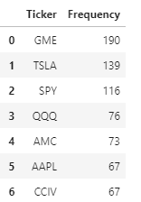

# Twitter Stock Screener

+ Summary
+ Tools used
+ Results 
+ Links to code 

## 1. Summary

With the rise in social media influence on stock market returns, I thought it would be interesting to analyze data and see if there is a correlation between frequency of mention and stock price movement. This was achieved by gathering data from the Tweepy Twitter API analyzing 20,000 tweets from various finance gurus and influencers within a week timeframe. This curated list of Twitter handles could be used to gage interest in stocks can be found here: [Handles](DEGA_NAMES.csv) 

Utilizing the Tweepy API, I was able to gate date from the curated list and extract the stock tickers through cashtags. Here are the most mentioned tickers for the test time period: 




From our date the most discussed stocks were AAPL, TSLA, CCIV, GME and AMC.

## 2. Tools used


In order to run the notebook with the code, you need a twitter developer account, after being approved, you will receive consumer keys, consumer_secrets, access_token and access_token_secret to access the API. Here is a link to help you start learning about the Twitter API, [Twitter Starter Guide.](https://developer.twitter.com/en/docs/twitter-api/getting-started/guide)
Once you have the keys, you must create a file called API.env on the same folder you are running the notebook with the following:

```
consumer_keys = "Enter it here"
consumer_secrets = "Enter it here"
access_token = "Enter it here"
access_token_secret = "Enter it here"
```
Once you have that set up you are going to need python. This can be done by going to the [python](https://www.python.org/downloads/) website if you don't have it.

I am using a jupyter notebook in an anaconda environment. If you do not have anaconda, check the [Anaconda installation documentation.](https://docs.anaconda.com/anaconda/install/) I also downloaded all the pips in a conda environment. If you don't have and environment set up in conda, follow the commands/instructions below.

Python package downloads:

```

pip install tweepy
pip install yfinance 
pip install -U python-dotenv
pip install -U textblob
pip install seaborn
pip install matplotlib.pyplot
pip install regex
pip install requests
pip install datetime
pip install alpaca-trade-api
pip install pandas
```
These are the libraries imported to run the notebook from the pip's from above.

```
import tweepy
import pandas as pd
import re
import yfinance as yf
import pandas as pd
import matplotlib.pyplot as plt
import seaborn as sns
import datetime
import time
import requests
import os
import plotly.graph_objects as go
from tweepy import OAuthHandler
import alpaca_trade_api as tradeapi
#from dotenv import load_dotenv
from textblob import TextBlob
```

## 3. Results

I decided to remove SPY and QQQ ETF from the results and built an equally weighted portfolio of the remaining top five stocks. 


Financial data was received from yfinance. The information being fetched from each ticker is the Open, High, Low, Close, Adj Close and Volume. I then used Plotly to visualize the returns of the 5 stock portfolio versus a benchmark starting on March 1, 2021 through June 30, 2021. 


## 4. Link to the code


* [Notebook of the code](Code/DEGA.ipynb)
* [DEGA tool- a tool to save tweets](Code/DEGA_TOOL.ipynb)
* [Portfolio Returns notebook](Code/portfolio_returns.ipynb)
* [Tickergrab Tool - from txt file](Code/tickergrab.ipynb)

